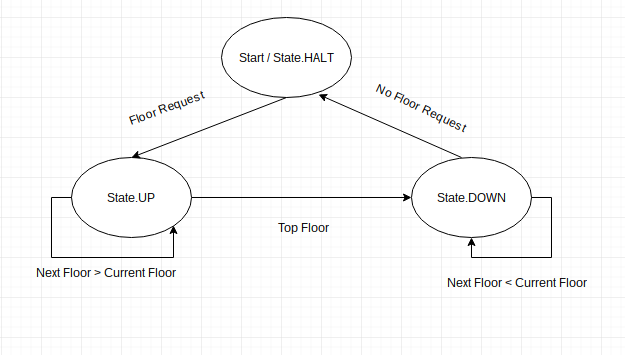

# Elevator Simulation

An experimental elevator simulation for experimenting with object-oriented and Clean Architecture principles.

## Purpose

To simulate an operating elevator

# Features

### Setup

* Initial floor 0

### Operations

* (done) move an elevator to a floor
* (done) request the elevator visit a floor
* (done) route the elevator to all requested floors if requests

### Assess

* None

## Movement algorithm

* Continue traveling in the same direction while there are remaining requests in that same direction.
* If there are no further requests in that direction, then stop and become idle, or change direction if there are requests in the opposite direction.

## Assumptions and Constraints

* Number of elevators? 1
* Top floor? not yet implemented
* Lowest floor? not yet implemented
* Single request button on each floor, not up/down

## Running tests

```sh
$ bin/rspec --format doc
```

## State Diagram



Contribution
---

We are following [this](http://nvie.com/posts/a-successful-git-branching-model/) model.

### Steps

1. Create a new branch from `master` branch

```sh
# from master branch
$ git checkout -b <branch_name>
```

2. Do the required changes

```sh
$ git add .
$ git commit -m "message for commit"
```

3. Push to the remote `origin`

```sh
$ git push origin <name_of_the_newly_created_branch>
```
